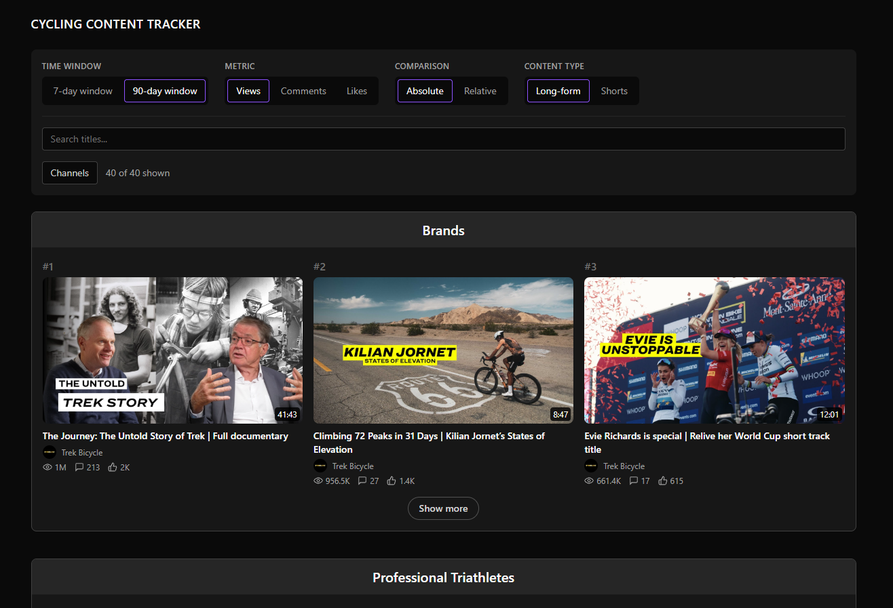

# Cycling Content Tracker
**[View the live site →]https://you-tube-cycling-platform.vercel.app/**

Finds the YouTube videos that outperformed in cycling and triathlon, so a marketing team can see what is working in the sector without watching forty channels by hand.

Tracks 40 channels across four categories — cycling brands, professional triathletes, professional teams, and cycling media and influencers — and ranks their videos both on raw numbers and on how far each video beat what is normal *for its own channel*.




## The idea

A channel averaging 2,000 views that hits 12,000 has done something far more interesting than a channel averaging 10,000 that hits 12,000. Absolute view counts hide that completely — they just rank the biggest channels first, every time, which tells a marketer nothing they did not already know.

So the headline metric is relative. Each video's figure is divided by the median figure of that channel's own recent videos, giving an **Outlier Score** displayed as a multiple: `3.4×` means the video did three and a half times its channel's normal.

Both sides of that ratio are measured at the same age, so the comparison is like for like. Two windows are available:

| Window | What it answers |
|---|---|
| **7-day** | What is trending — each video's figure at exactly 7 days old, against the channel's median 7-day figure |
| **90-day** | Best of all time — the same comparison at a longer horizon |

The median is used rather than the mean on purpose. View counts in this sector are heavily right-skewed — a team's routine output sits at 2–5K views while one rider documentary takes 300K — and a mean would absorb exactly the outliers the product exists to find. Scores range from 0.03 to around 75.

Where a channel has too few reference videos for a trustworthy baseline, the score carries a **Provisional** label rather than being hidden. That is permanent furniture, not a temporary gap: any newly added channel starts thin.

## What you can filter

Four measurement filters — time window, metric (views, comments or likes), absolute versus relative, and long-form versus Shorts — for 24 valid combinations. Beneath a dividing rule sit two relevance filters: a title search, and a channel exclusion control.

That split is deliberate. The first four answer *how do we measure*. The last two answer *what is relevant to me* — a road brand may find a BMX video genuinely high-performing and still irrelevant, and no measurement filter can express that.

Long-form and Shorts never share a ranking, because their view counts sit on entirely different scales.

## Constraints worth knowing

Three things shaped this more than any design decision:

**Watch time is unavailable.** Retention, CTR and watch time sit behind the YouTube Analytics API and need consent from each channel owner. Impossible for channels you do not own, so it was dropped rather than approximated.

**The API holds no history.** It returns a single point-in-time snapshot, and there is no way to ask what a video's view count was last week. Every historical figure here exists only because collection started before anything else was built.

**Shorts have no API flag.** The obvious test — anything under three minutes is a Short — fails badly on this dataset, because brand channels publish short product videos as ordinary uploads. Classification uses an unofficial endpoint check instead, verified against videos of known status before being trusted.

## How it is built

A Python job runs daily on GitHub Actions, walking each channel's uploads playlist and writing one row per video per run into Supabase. Every run is logged, and three failure checks must pass before the data is published to the page — a run that under-collects is treated as failed, not as a quiet success. A dead man's switch catches the case the logs cannot: the job never running at all.

The front end is a static React site reading a materialised Postgres view. All scoring lives in that view, so the baseline, the pool and the thresholds can change in SQL without the front end knowing.

## The decision log

Every architectural and scoping choice is recorded in [`DECISIONS.md`](DECISIONS.md), with the reasoning rather than just the outcome — including the ones that were reversed, and why. If you only read one file here, read that one.

[`CLAUDE.md`](CLAUDE.md) holds the brief and the data model. [`NEXT_STEPS.md`](NEXT_STEPS.md) is the working checklist.

## Status

Prototype, deployed and collecting. The collection job has been unattended
since August 2026 and holds around 4,000 videos across 40 channels.

The site is live on Vercel and `robots.txt` disallows all crawlers, so it
is reachable by anyone holding the URL and deliberately not discoverable by
anyone who is not. That is a limit on discoverability rather than on
access, and it follows a review of YouTube's API Terms — see `DECISIONS.md`
for both.

The site is [live on Vercel](https://you-tube-cycling-platform.vercel.app) and `robots.txt`
disallows all crawlers, so it is reachable by anyone holding the URL and
deliberately not discoverable by anyone who is not.

---

## Running it yourself

### Requirements

- Python 3.11+
- Node 18+
- A Supabase project
- A YouTube Data API v3 key

### Setup

```bash
git clone https://github.com/mrvalentinglenn/YouTube-Cycling-Platform.git
cd YouTube-Cycling-Platform
pip install -r requirements.txt
```

Copy `.env.example` to `.env` and fill in your own values:

```
YOUTUBE_API_KEY=
SUPABASE_URL=
SUPABASE_SECRET_KEY=
```

`HEALTHCHECKS_URL` is deliberately left out of the local `.env`. It belongs in GitHub Secrets only — a manual test run from a laptop must not be able to ping the monitor and silence an alarm about the *scheduled* job having failed.


### Database

Run `sql/schema.sql` then `sql/scoring_view.sql` in the Supabase SQL editor,
in that order.

Then create a Storage bucket named `channel-avatars`, set to public. Channel
avatars are downloaded from YouTube and served from there rather than
hotlinked. The bucket is not created by either SQL file — Storage buckets
are not SQL objects — so it has to be made by hand before the first
backfill, or every avatar upload fails and `channels.avatar_url` stays null.

### Collecting data

```bash
python scripts/collect.py --mode backfill   # once, before anything else
python scripts/collect.py                   # window derived from today's date
```

The window is tiered: 8 days on most days, 90 days on Mondays. `--mode daily` and `--mode weekly` override it for testing.

### Front end

```bash
cd frontend
npm install
npm run dev
```

`frontend/.env.example` lists its own two variables. The two env files stay separate on purpose — the secret key bypasses row-level security and must never sit alongside anything the browser reads.

### Layout

```
scripts/collect.py            collection job
sql/schema.sql                tables, grants, RLS
sql/scoring_view.sql          scoring logic and the materialised view
frontend/                     Vite + React + Tailwind (see frontend/README.md)
frontend/vercel.json          SPA route rewriting
.github/workflows/collect.yml daily schedule
```

## Built with

Python · Supabase (PostgreSQL) · GitHub Actions · Healthchecks.io · Vite · React · React Router · Tailwind CSS